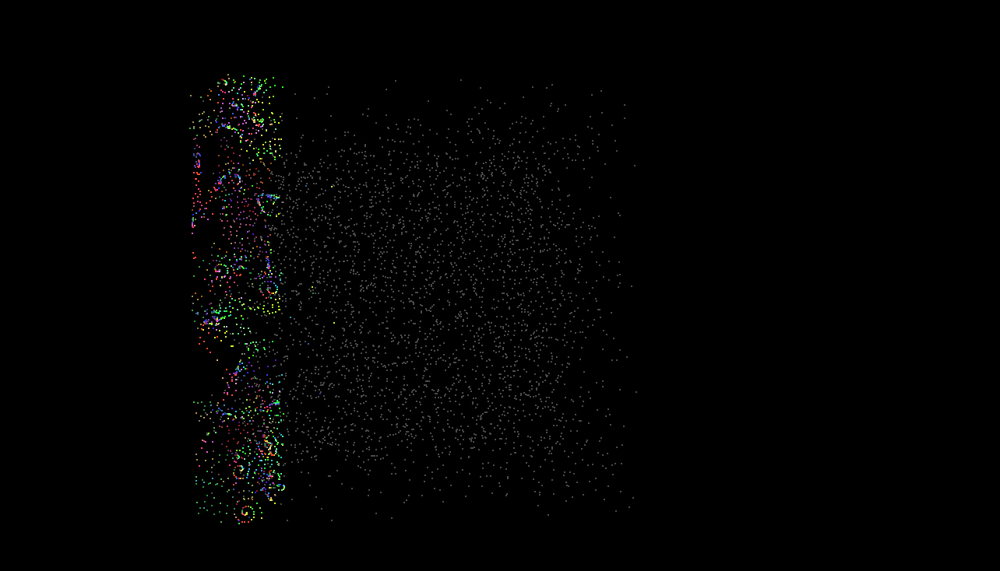

**University of Pennsylvania, CIS 565: GPU Programming and Architecture,
Project 1 - Flocking**

* Name: Vaibhav Arcot
  *  [LinkedIn](https://www.linkedin.com/in/vaibhav-arcot-129829167/)
* Tested on: Windows 10, i7-7700HQ @ 2.8GHz (3.8 Boost) 32GB, External GTX 1080Ti, 11G (My personal laptop)

## Boids Flocking Overview

In the Boids flocking simulation, particles representing birds or fish
(boids) move around the simulation space according to three rules:

1. cohesion - boids move towards the perceived center of mass of their neighbors
2. separation - boids avoid getting to close to their neighbors
3. alignment - boids generally try to move with the same direction and speed as
their neighbors

These three rules specify a boid's velocity change in a timestep.
At every timestep, a boid thus has to look at each of its neighboring boids
and compute the velocity change contribution from each of the three rules.
Thus, a bare-bones boids implementation has each boid check every other boid in
the simulation.

Here is some pseudocode:

#### Rule 1: Boids try to fly towards the center of mass of neighboring boids

```
function rule1(Boid boid)

    Vector perceived_center

    foreach Boid b:
        if b != boid and distance(b, boid) < rule1Distance then
            perceived_center += b.position
        endif
    end

    perceived_center /= N-1

    return (perceived_center - boid.position) * rule1Scale
end
```

#### Rule 2: Boids try to keep a small distance away from other objects (including other boids).

```
function rule2(Boid boid)

    Vector c = 0

    foreach Boid b
        if b != boid and distance(b, boid) < rule2Distance then
            c -= (b.position - boid.position)
        endif
    end

    return c * rule2Scale
end
```

#### Rule 3: Boids try to match velocity with near boids.

```
function rule3(Boid boid)

    Vector perceived_velocity

    foreach Boid b
        if b != boid and distance(b, boid) < rule3Distance then
            perceived_velocity += b.velocity
        endif
    end

    perceived_velocity /= N-1

    return perceived_velocity * rule3Scale
end
```
Based on [Conard Parker's notes](http://www.vergenet.net/~conrad/boids/pseudocode.html) with slight adaptations. For the purposes of an interesting simulation,
we will say that two boids only influence each other according if they are
within a certain **neighborhood distance** of each other.
### Methods of implementation
3 methods for computing the neighborhood of each boid was done. 
####Naive Method 
The first is the naive method, where every boid checks every other boid and sees if the distance is within the **neighborhood distance**. Because global memory access is slow, this method does not scale well with an increase in the number of boids being simulated.
#### Uniform Grid Method
For the second approach, a uniform grid was constructed over the space (with width = 2\***neighborhood distance**). Each boid is assigned to its respective cell based on its position. Then each boid checks the neighboring cells and their boids inside them. The number of cells that need to be checked becomes 8, making this more efficient
#### Coherent Grid Method
This method builds upon the previous method, with the main difference being it makes accessing velocities and position of neighboring boids easier (by using the cells to sort the position and velocity arrays), making it require less access to get the velocity and position of a boid.
## Results and Performance Analysis
### Results
Below is a video of the particles flocking.


### Analysis
To analyze the performance of the 3 methods, FPS data was collected for various numbers of boids. These plots are shown below. One was collected with the visualization turned on while the other had the visualization turned off.


Next, data was collected for different block sizes, to see the difference it has


Finally, data was collected for different neighborhood sizes, 8 and 27 cells around the current boid.


## Interesting Observations
### Change in the number of object
As expected, coherent grid method performs the best when the number of boids increase. For lower counts of boids, the coherent grid method performs similarly to the uniform grid method. For very low values (like 1000), not many boids have a single cell within their distance of influence so it takes a long time to form clusters, shown below


### Block size increase 
Increasing the block size has an effect on the performance up to some point. After which, the performance does not benefit further from an increase.
### Interesting error
During the implementation, a lot of interesting bug showed. One of my favorite is shown below. This was caused because of an error in the reshuffling portion of the coherent grid method.



### Sorting approach to the Coherent uniform grid method
While implementing the final section, my first approach was to sort the velocity and position vectors using the same keys we used to sort the index. After implementing this, it turned out to be slower than the regular uniform grid approach. I believe this is because thrust wasn't great at handling large data (requiring too many reads to sort). On profiling the code, as expected the majority of the time (by a large margin) was spent in the sort function. The issue was that only 25% of the GPU was being utilized. After changing this to use a custom reshuffle function, the performance went back up again.
## Questions and Answers
* **Question**: For each implementation, how does changing the number of boids affect performance? Why do you think this is?

* **Answer**: For each implementation, Increasing the number of boids to simulate has a negative impact on performance. This happens because with an increase in the number of boids, there is an increase in the number of neighbors each cell has, the more time it takes to compute the resultant velocity.
* **Question**: For each implementation, how does changing the block count and block size affect performance? Why do you think this is?

* **Answer**: For both grid implementations, there is a performance increase (up to a point) with an increase in block size. After a point (64 in my case), it doesn't seem to have any noticeable improvement. For the naive approach, there didn't seem to be any change in performance while increasing the block size.
* **Question**: For the coherent uniform grid: did you experience any performance improvements with the more coherent uniform grid? Was this the outcome you expected? Why or why not?

* **Answer**: There was a performance improvements by using the coherent uniform grid approach. The improvement is most noticeable when the number of particles becomes large (50k in my case). When this happens, the access time becomes more than the time required to rearrange the position and velocity vectors.
* **Question**:Did changing cell width and checking 27 vs 8 neighboring cells affect performance? Why or why not? Be careful: it is insufficient (and possibly incorrect) to say that 27-cell is slower simply because there are more cells to check!

* **Answer**: If we only increasing the cell width results in a drop in performs. This is because with an increase in cell width, the number of boids to check could potentially go up (even more likely with a large number of boids to simulate). Similarly, if we only change the number of cells to check from 8 to 27, there could be a performance hit (shown in the Analyze section).
